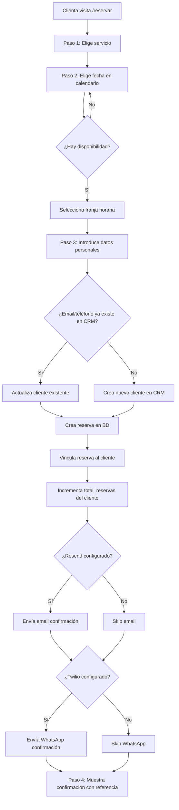
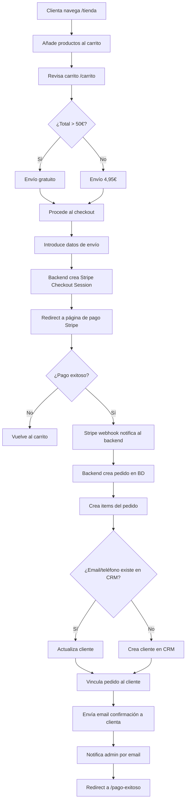
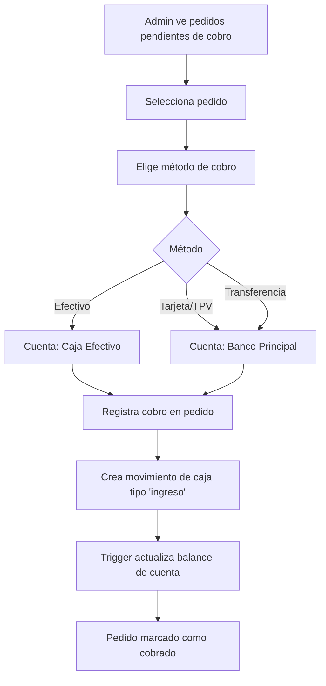
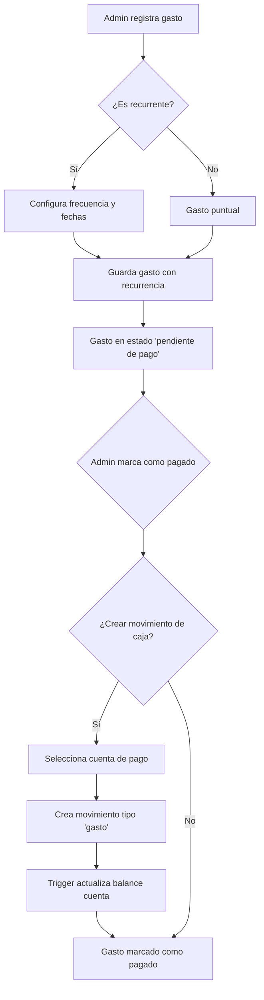
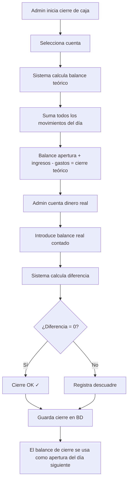
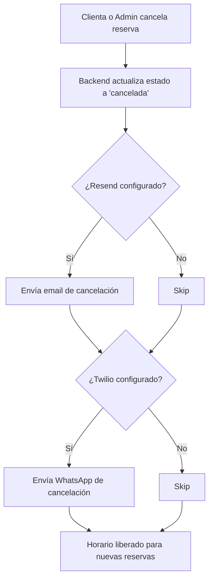
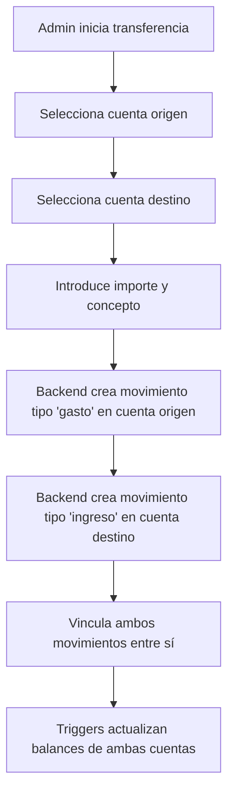

# The Lobby Beauty — Flujos de Negocio

## 1. Reserva de cita (cliente)

Flujo completo desde que la clienta decide reservar hasta que recibe confirmación.



**Actores:** Clienta, Sistema (backend), CRM, Resend (email), Twilio (WhatsApp)

**Validaciones:**
- El servicio debe estar activo
- La fecha debe ser futura
- No puede haber otra reserva no-cancelada en la misma fecha/hora
- La duración del servicio no debe solapar con otras reservas

**Errores posibles:**
- Servicio no encontrado o inactivo → Error 404
- Horario ya ocupado (reservado entre petición y confirmación) → Error 400
- Fallos de email/WhatsApp → Se registran pero no bloquean la reserva

---

## 2. Compra online (e-commerce)

Flujo desde que la clienta añade productos al carrito hasta que recibe el pedido.



**Actores:** Clienta, Frontend (carrito localStorage), Backend, Stripe, CRM, Resend

**Datos del pedido:**
- Productos con cantidades y precios
- Dirección de envío completa
- ID de sesión Stripe
- Estado inicial: "pagado" (si webhook OK) o "pendiente"

**Fallback:**
- Si el webhook de Stripe no llega, existe endpoint `verify-session` que la clienta puede usar al volver a la página de éxito

---

## 3. Gestión de cobros (admin)

Flujo para registrar el cobro efectivo de un pedido y reflejarlo en tesorería.



**Actores:** Admin, Sistema

**Campos registrados:**
- Método de cobro (efectivo, tarjeta, TPV, transferencia)
- Fecha de cobro
- Cuenta destino (automática según método)

---

## 4. Control de gastos (ERP)

Flujo de registro y pago de gastos del negocio.



**Recurrencia:**
- Frecuencias: semanal, quincenal, mensual, bimestral, trimestral, semestral, anual
- Se puede definir fecha de inicio y fin de recurrencia
- El gasto padre genera ocurrencias hijas

---

## 5. Cierre de caja diario

Proceso de reconciliación de caja al final del día.



**Datos del cierre:**
- Balance de apertura
- Total ingresos del día (desglosado por tipo)
- Total gastos del día (desglosado por tipo)
- Balance cierre teórico (calculado)
- Balance cierre real (contado)
- Diferencia (automática)
- Número de operaciones
- Notas del operador

---

## 6. CRM automático — Creación de cliente

Flujo interno que ocurre automáticamente con cada reserva o pedido.

```mermaid
sequenceDiagram
    participant R as Reserva/Pedido
    participant B as Backend
    participant CRM as Tabla clientes
    participant Link as Tabla link

    R->>B: Nueva reserva/pedido con email y teléfono
    B->>CRM: ¿Existe cliente con este email?
    alt Email encontrado
        CRM-->>B: Cliente existente (ID)
        B->>CRM: Actualizar datos si más completos
    else Email no encontrado
        B->>CRM: ¿Existe cliente con este teléfono?
        alt Teléfono encontrado
            CRM-->>B: Cliente existente (ID)
            B->>CRM: Actualizar datos
        else No encontrado
            B->>CRM: Crear nuevo cliente
            CRM-->>B: Nuevo ID
        end
    end
    B->>Link: Vincular reserva/pedido al cliente
    B->>CRM: Incrementar total_reservas o total_pedidos
    B->>CRM: Actualizar ultima_visita o ultima_compra
```

**Origen asignado:**
- Desde reserva web → `origen: 'reserva'`
- Desde pedido web → `origen: 'pedido'`
- Creado manualmente por admin → `origen: 'manual'`
- Importado desde CSV → `origen: 'importacion'`

---

## 7. Cancelación de reserva



**Nota:** La restricción UNIQUE en `reservas(fecha, hora) WHERE estado != 'cancelada'` permite que al cancelar, el horario quede libre automáticamente para nuevas reservas.

---

## 8. Transferencia entre cuentas



**Datos registrados:**
- Ambos movimientos con `referencia_tipo: 'transferencia'`
- Campo `cuenta_destino_id` en el movimiento origen
- Campo `movimiento_relacionado_id` vincula los dos movimientos
